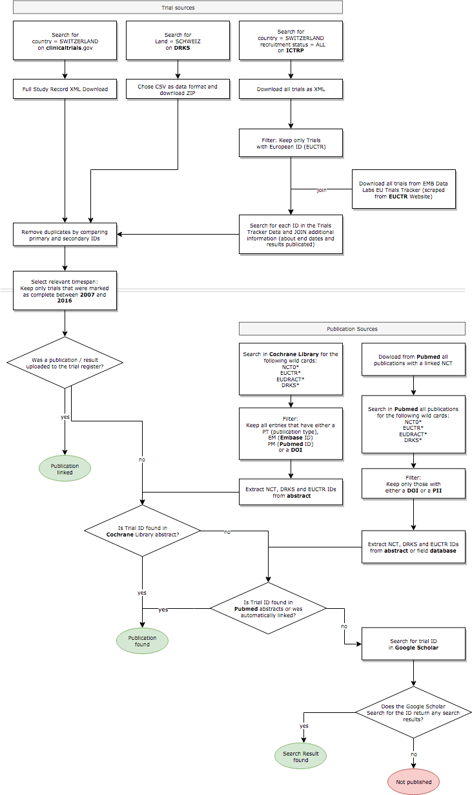

```{r, echo=FALSE}
# CONFIG
user_name <- "srfdata" # github user name
project_name <- "2019-02-clinical-trials" # adapt to new repo name
package_date <- "2018-09-01" # date of the CRAN snapshot that
# the checkpoint package uses
R_version <- "3.5.0" # R-Version to use
options(Ncpus = 4) # use 4 cores for parallelized installation of packages
if (R_version != paste0(version$major, ".", version$minor)){
  stop("ERROR: specified R version does not match currently used.")
}
```

#### Notes

This report was generated on `r Sys.time()`. R version: `r paste0(version$major, ".", version$minor)` on `r version$platform`. For this report, CRAN packages as of `r package_date` were used.

### R-Script & data

The preprocessing and analysis of the data was conducted in the [R project for statistical computing](https://www.r-project.org/). The RMarkdown script used to generate this document and all the resulting data can be downloaded [under this link](http://`r user_name`.github.io/`r project_name`/rscript.zip). Through executing `main.Rmd`, the herein described process can be reproduced and this document can be generated. In the course of this, data from the folder `ìnput` will be processed and results will be written to `output`. There are multiple `RData` files in the folder `rdata`. They are emitted in the chunks of `main.Rmd` and saved for a faster process after the first execution. The download stored to `input/ignore/pubmed` could not be saved in this git repository, because of it's size (1.4 GB). Find out how to get your own version of the xml file below.

### GitHub

The code for the herein described process can also be freely downloaded from [https://github.com/`r user_name`/`r project_name`](https://github.com/`r user_name`/`r project_name`).

### License

<a rel="license" href="http://creativecommons.org/licenses/by-sa/4.0/"></a><br /><span xmlns:dct="http://purl.org/dc/terms/" href="http://purl.org/dc/dcmitype/Dataset" property="dct:title" rel="dct:type">`r project_name`</span> by <a xmlns:cc="http://creativecommons.org/ns#" href="https://github.com/srfdata/`r project_name`" property="cc:attributionName" rel="cc:attributionURL">SRF Data</a> is licensed under a <a rel="license" href="http://creativecommons.org/licenses/by-sa/4.0/">Creative Commons Namensnennung - Attribution ShareAlike 4.0 International License</a>.


### Data description of output files

#### `trials.csv`

| Attribute | Type | Description |
|-------|------|-----------------------------------------------------------------------------|
| unique_id | String | Unique identifier assigned by SRF |
| primary | String | Trial identification number |
| size | Numeric | Number of people participating in study (total, world wide) |
| study_type | Factor | Type of study, either Interventional or Observational |
| status | Factor | Status of the trial, either Completed, Ongoing, Terminated or Unknown |
| primary_sponsor | String | The primary sponsor of the trial (responsible for updating register information) |
| leading_institution | String | The (scientifically) leading institution of the trial |
| registration_date | Date | Date the trial was registered in the registry |
| start_date | Date | Date on which the enrollment process started |
| end_date | Date | Date on which the enrollment process ended |
| results_submitted | Boolean | Equals true if a result was submitted to the trial registry |
| publication_found | Boolean | Equals true if the trial ID was found in cochrane / pubmed |
| source | Factor | Shows in which registry this trial was found, either NCT, EUCTR or DRKS |
| has_g_scholar_results | Boolean | Equals true if google scholar returned any results when queried with the trial id |
| primary_sponsor_simple | String | Simplified Name of primary sponsor (mainly done for swiss institutions) |
| leading_institution_simple | String | Simplified Name of leading institution (mainly done for swiss institutions) |


### Procedure

On the flow chart below, we describe how we tried to find all trials related to Switzerland and how we evaluated whether a publication for that trial exitsts.



## Data sources

#### Trials

We searched the following registers by selecting `Switzerland OR Schweiz` as a country of recruitement:

##### WHO (ICTRP)

→ <http://apps.who.int/trialsearch/AdvSearch.aspx>

Downloaded **01/14/2019 at 12:35 CET** by setting recruitment status to `ALL` and chosing `Export all trials to XML`.

##### ClinicalTrials.gov

→ <https://clinicaltrials.gov/ct2/results?cond=&term=Switzerland&cntry=&state=&city=&dist=>

Downloaded **01/14/2019 at 12:31 CET** via `Download > For Advanced Users: Full Study Record XML Download`.

##### Deutsches Register Klinischer Studien (DRKS)

→ <https://www.drks.de/drks_web/navigate.do?navigationId=search&reset=true>

Downloaded **01/24/2019 at 13:20 CET** as `csv`.

#### Publications

##### Pubmed

You can query PubMed for all publications with a linked NCT ClinicalTrials.gov ID:

→ <https://www.ncbi.nlm.nih.gov/pubmed/?cmd=Search&term=clinicaltrials.gov%5bsi%5d>

We also search the following terms and saved the result as xml by choosing `Send to > File > XML`:

- `EUDRACT*`
- `EUCTR*`
- `NCT0*`
- `DRKS*`

<https://www.ncbi.nlm.nih.gov/pubmed?term=(((EUDRACT*)%20OR%20EUCTR*)%20OR%20NCT0*)%20OR%20DRKS*>

Downloaded **01/14/2019 at 10:56 CET**.

You can read more about finding results of studies on [ClinicalTrials.gov](https://clinicaltrials.gov/ct2/help/how-find/find-study-results).

##### Cochrane

→ <http://cochranelibrary-wiley.com/cochranelibrary/search?searchRow.searchOptions.searchProducts=clinicalTrialsDoi>

Downloaded **01/14/2019 at 10:25 CET** by searching ID wildcards e.g. `*NCT0*` in `ti, ab, kw` (Title, Abstract, Keywords).

Limit the years to get the total number of trials below the export limit of 20k.

Search terms:

- `NCT0*`
- `EUCTR*`
- `EUDRACT*`
- `Switzerland`

Read more about the Cochrane CENTRAL database [here](http://www.cochranelibrary.com/help/central-creation-details.html).

##### Kofam/BASEC

The swiss registry for trials is only a secondary register. All the trials in it must also be registered in one of the primary registers (European, German, American registers). It does not contain any information about whether a trial was started or completed.


## Preparations

```{r preparations, echo = FALSE}
detach_all_packages <- function() {
  basic_packages_blank <-  c("stats",
                             "graphics",
                             "grDevices",
                             "utils",
                             "datasets",
                             "methods",
                             "base")
  basic_packages <- paste("package:", basic_packages_blank, sep = "")

  package_list <- search()[
    ifelse(unlist(gregexpr("package:", search())) == 1, TRUE, FALSE)]

  package_list <- setdiff(package_list, basic_packages)

  if (length(package_list) > 0)  for (package in package_list) {
    detach(package, character.only = TRUE, unload = TRUE)
    print(paste("package ", package, " detached", sep = ""))
  }
}

detach_all_packages()

# this allows multiple persons to use the same RMarkdown
# without adjusting the working directory by themselves all the time
source("scripts/csf.R")
path_to_wd <- csf() # if this - for some reason - does not work,
# replace with a hardcoded path, like so: "~/projects/rddj-template/analysis/"
if ( is.null(path_to_wd) | !dir.exists(path_to_wd)) {
  print("WARNING: No working directory specified for current user")
} else {
  setwd(path_to_wd)
}

# suppress scientific notation
options(scipen = 999)

# unload global rstudioapi and knitr again to avoid conflicts with checkpoint
# this is only necessary if executed within RStudio
# outside of RStudio, namely in the knit.sh script, this causes RMarkdown
# rendering to fail, thus should not be executed there
if (Sys.getenv("RSTUDIO") == "1"){
  detach_all_packages()
}
```


### Define packages

```{r define packages, echo=TRUE, message=FALSE, warning=FALSE}
# from https://mran.revolutionanalytics.com/web/packages/checkpoint/vignettes/using-checkpoint-with-knitr.html
# if you don't need a package, remove it from here (commenting is probably not sufficient)
# tidyverse: see https://blog.rstudio.org/2016/09/15/tidyverse-1-0-0/
cat("
library(rstudioapi)
library(tidyverse) # ggplot2, dplyr, tidyr, readr, purrr, tibble
library(glue) # interpreted string literals
library(ggrepel) # repellingng text labels for ggplot
library(xml2) # read xml files
library(readxl) # read xls(x) files
library(rvest) # used for scraping
library(magrittr) # pipes
library(foreach) # parallelization
library(doParallel) # parallelization
library(stringr) # string manipulation
library(scales) # scales for ggplot2
library(jsonlite) # json
library(lubridate) # date handling
library(forcats) # easier factor handling,
library(lintr) # code linting, auf keinen Fall entfernen ;-)
library(styler) # code formatting
library(googlesheets) # googlesheets (replace with tidyverse/googlesheets4 asap)
library(rmarkdown) # needed for automated knitting
library(R.utils) # needed for withTimeout",
  file = "manifest.R"
)
```

### Install packages

```{r install packages, echo=TRUE, message=FALSE, warning=FALSE}
# if checkpoint is not yet installed, install it (for people using this
# system for the first time)
if (!require(checkpoint)) {
  if (!require(devtools)) {
    install.packages("devtools", repos = "http://cran.us.r-project.org")
    require(devtools)
  }
  devtools::install_github("RevolutionAnalytics/checkpoint",
                           ref = "v0.3.2", # could be adapted later,
                           # as of now (beginning of July 2017
                           # this is the current release on CRAN)
                           repos = "http://cran.us.r-project.org")
  require(checkpoint)
}
# nolint start
if (!dir.exists("~/.checkpoint")) {
  dir.create("~/.checkpoint")
}
# nolint end
# install packages for the specified CRAN snapshot date
checkpoint(snapshotDate = package_date,
           project = path_to_wd,
           verbose = T,
           scanForPackages = T,
           use.knitr = F,
           R.version = R_version)
rm(package_date)
```


### Load packages

```{r load packages, echo=TRUE, message=FALSE, warning=FALSE}
source("manifest.R")
unlink("manifest.R")
sessionInfo()
```

```{r register number of cores, echo = FALSE}

# set number of cores to number of physical cores available
registerDoParallel(cores = detectCores(logical = FALSE))

```


## Read in data

### Trials

##### ClinicalTrials.gov

We read the data from the files (one xml file per study) and collect it in multiple "lookup tables" (because one trial can have multiple locations and sponsors in an 1:n relationship). You can see what nodes of the xml file we use in the code below.

The xml files are not included in this git repo. Read the chapter [data sources](#data_sources) and download your own version of the file, if you wish to reproduce the report or work with the provided `rdata` file.or work with the provided `rdata` file.

```{r clinicaltrials xml}

# load data form rdata file if is present
if (
  file.exists("rdata/nct_trials.rdata") &
  file.exists("rdata/nct_locations.rdata") &
  file.exists("rdata/nct_sponsors.rdata") &
  file.exists("rdata/nct_citations.rdata") &
  file.exists("rdata/nct_officials.rdata")
) {
  load(file = "rdata/nct_trials.rdata")
  load(file = "rdata/nct_locations.rdata")
  load(file = "rdata/nct_sponsors.rdata")
  load(file = "rdata/nct_citations.rdata")
  load(file = "rdata/nct_officials.rdata")
} else {
  # create new data frame for xmls data
  # one main data frame will contain one row per trial
  nct_trials <- data.frame()
  # the following data frames can contain more than one row per trial
  nct_locations <- data.frame()
  nct_sponsors <- data.frame()
  nct_citations <- data.frame()
  nct_officials <- data.frame()

  # the following function has side effects! It looks up the XML data for a
  # given NCT ID by reading the file "input/...NCTID.xml" and adding it to the
  # data frames above so they can be joined later
  extract_info_from_file <- function(filename) {
    # get xml file
    xml <- read_xml(filename)
    # store id in variable as it's used multiple times
    nct_id <- xml_text(xml_find_first(xml, ".//id_info/nct_id"))
    # append to main data frame
    nct_trials <<- nct_trials %>% bind_rows(
      data.frame(
        "id" = nct_id,
        "secondary_id" = xml_text(
          xml_find_first(xml, ".//id_info/secondary_id")
        ),
        "source" = xml_text(
          xml_find_first(xml, ".//source")
        ),
        "size" = xml_text(
          xml_find_first(xml, ".//enrollment")
        ),
        "study_type" = xml_text(
          xml_find_first(xml, ".//study_type")
        ),
        "overall_status" = xml_text(
          xml_find_first(xml, ".//overall_status")
        ),
        "clinical_results_present" = length( # if node is present
          xml_find_all(xml, ".//clinical_results")
        ) > 0,
        "start_date" = xml_text(
          xml_find_first(xml, ".//start_date")
        ),
        "completion_date" = xml_text(
          xml_find_first(xml, ".//completion_date")
        ),
        "primary_completion_date" = xml_text(
          xml_find_first(xml, ".//primary_completion_date")
        ),
        "study_first_submitted" = xml_text(
          xml_find_first(xml, ".//study_first_submitted")
        ),
        "study_first_submitted_qc" = xml_text(
          xml_find_first(xml, ".//study_first_submitted_qc")
        ),
        "study_first_posted" = xml_text(
          xml_find_first(xml, ".//study_first_posted")
        ),
        "results_first_submitted" = xml_text(
          xml_find_first(xml, ".//results_first_submitted")
        ),
        "results_first_submitted_qc" = xml_text(
          xml_find_first(xml, ".//results_first_submitted_qc")
        ),
        "results_first_posted" = xml_text(
          xml_find_first(xml, ".//results_first_posted")
        ),
        "submitted_pending_results" = xml_text(
          xml_find_first(xml, ".//pending_results/submitted")
        ),
        "why_stopped" = xml_text(
          xml_find_first(xml, ".//why_stopped")
        ),
        # the following subchildren can only be accessed if the parent
        # node overall_official is present, otherwise they cause errors
        "overall_official" = ifelse(
          length(xml_find_all(xml, ".//overall_official")) > 0,
          xml_text(xml_find_first(xml, ".//overall_official/last_name")),
          NA # if not present
        ),
        "official_role" = ifelse(
          length(xml_find_all(xml, ".//overall_official")) > 0,
          xml_text(xml_find_first(xml, ".//overall_official/role")),
          NA # if not present
        ),
        "official_affiliation" = ifelse(
          length(xml_find_all(xml, ".//overall_official")) > 0,
          xml_text(xml_find_first(xml, ".//overall_official/affiliation")),
          NA # if not present
        ),
        stringsAsFactors = FALSE
      )
    )

    # get locations
    xml_find_all(xml, ".//location") %>%
      # keep only those with country Switzerland
      keep(~ xml_text(xml_find_first(., ".//country")) == "Switzerland") %>%
      walk(function(node) {
        # append to data frame
        nct_locations <<- nct_locations %>% bind_rows(
          data.frame(
            "id" = nct_id,
            "name" = xml_text(xml_find_first(node, ".//name")),
            "city" = xml_text(xml_find_first(node, ".//city")),
            stringsAsFactors = FALSE
          )
        )
      })

    # get sponsors
    xml_find_all(xml, ".//lead_sponsor|.//collaborator") %>%
      walk(function(node) {
        # append to data frame
        nct_sponsors <<- nct_sponsors %>% bind_rows(
          data.frame(
            "id" = nct_id,
            "sponsor" = xml_text(xml_find_first(node, ".//agency")),
            "type" = xml_name(node),
            "class" = xml_text(xml_find_first(node, ".//agency_class")),
            stringsAsFactors = FALSE
          )
        )
      })

    # get citations
    xml_find_all(xml, ".//results_reference") %>%
      walk(function(node) {
        # append to data frame
        nct_citations <<- nct_citations %>% bind_rows(
          data.frame(
            "id" = nct_id,
            "citation" = xml_text(xml_find_first(node, ".//citation")),
            "pm_id" = xml_text(xml_find_first(node, ".//PMID")),
            stringsAsFactors = FALSE
          )
        )
      })

    # get officials
    xml_find_all(xml, ".//overall_official") %>%
      walk(function(node) {
        # append to data frame
        nct_officials <<- nct_officials %>% bind_rows(
          data.frame(
            "id" = nct_id,
            "name" = xml_text(xml_find_first(node, ".//last_name")),
            "role" = xml_text(xml_find_first(node, ".//role")),
            "affiliation" = xml_text(xml_find_first(node, ".//affiliation")),
            stringsAsFactors = FALSE
          )
        )
      })
  }

  print("Now extracting data from XML files (ClinicalTrials.gov data)…")
  print("Takes about 2.5 minutes")

  # go over all entries
  system.time(
    list.files("input/ignore/clinicaltrials", full.names = TRUE) %>%
      walk(extract_info_from_file)
  )

  # save to rdata
  save(nct_trials, file = "rdata/nct_trials.rdata")
  save(nct_locations, file = "rdata/nct_locations.rdata")
  save(nct_sponsors, file = "rdata/nct_sponsors.rdata")
  save(nct_citations, file = "rdata/nct_citations.rdata")
  save(nct_officials, file = "rdata/nct_officials.rdata")

  # clean up
  rm(extract_info_from_file)

}

```

Some specifications about dates: 

* `study_first_submitted`: The date on which the study sponsor or investigator first submitted a study record to ClinicalTrials.gov. There is typically a delay of a few days between the first submitted date and the record's availability on ClinicalTrials.gov (the first posted date).

* `study_first_submitted_qc`: The date on which the study sponsor or investigator first submits a study record that is consistent with National Library of Medicine (NLM) quality control (QC) review criteria. The sponsor or investigator may need to revise and submit a study record one or more times before NLM's QC review criteria are met. It is the responsibility of the sponsor or investigator to ensure that the study record is consistent with the NLM QC review criteria.

* `primary_completion_date`: The date on which the last participant in a clinical study was examined or received an intervention to collect final data for the primary outcome measure. Whether the clinical study ended according to the protocol or was terminated does not affect this date. For clinical studies with more than one primary outcome measure with different completion dates, this term refers to the date on which data collection is completed for all the primary outcome measures. The "estimated" primary completion date is the date that the researchers think will be the primary completion date for the study. 

Conclusion: This report uses a trial’s **primary completion point as the key criterion to determine whether or not a trial is due** to post results.

We followed the argumentation of the [Clinical Trial Reporting](https://docs.wixstatic.com/ugd/01f35d_0e5a6fa138cc44b29612a431d68cad80.pdf): "University Policies and Performance in the UKBristol and London, 06 November 2018") This approach is likely to slightly overcount due trials. For example, if a trial’s expected primary completion date is extended during the trial due to slower than expected patient recruitment, and university staff fails to update the registry entry accordingly, the expected primary completion date listed in the registry will be further in the past than the actual or currently expected primary completion date. On balance, the approach used here has two significant advantages: In terms of accuracy, the number of trials falsely identified as overdue using this approach is assumed to be substantially lower than the number of trials falsely identified as not yet due when using the conventional approach. In terms of faithfully depicting a university’s registry management performance, this approach is preferable because it will never falsely identify trials as overdue if a university keeps its registry entries up to date. Thus, the approach used here incentivises universities to keep their registry entries up to date. In contrast, the conventional approach creates perverse incentives for trial sponsors to postpone or neglect updating a trial’s status to ‘completed’."


##### ICTRP

```{r ictrp xml}

# load data form rdata file if is present
if (file.exists("rdata/ictrp_trials.rdata")) {
  load(file = "rdata/ictrp_trials.rdata")
} else {
  # Read file. Caution! This file is 55MB, it contains 7602 Trials
  ictrp_xml <- read_xml("input/ictrp/ICTRP-Results.xml")
  ictrp_nodes <- xml_find_all(ictrp_xml, "//Trial")

  print("Now extracting data from XML file (ICTRP data)")

  # In this file there are no n to 1 relations, so we can read it in with one
  # split into batches of size 1000 nodes and calculate in parallel
  batch_size <- 1000
  split_factor <- as.factor(
    rep_len(
      1:ceiling(length(ictrp_nodes) / batch_size),
      length.out = length(ictrp_nodes)
    )
  )
  system.time(
    ictrp_trials <- foreach(
      node = split(ictrp_nodes, split_factor),
      .inorder = FALSE,
      .combine = rbind
    ) %dopar%
      data.frame(
        "id" =
          xml_text(xml_find_first(node, ".//TrialID")),
        "secondary" =
          xml_text(xml_find_first(node, ".//Secondary_ID")),
        "size" =
          xml_text(xml_find_first(node, ".//Target_size")),
        "study_type" =
          xml_text(xml_find_first(node, ".//Study_type")),
        "registration_date" =
          xml_text(xml_find_first(node, ".//Date_registration")),
        "enrollment_date" =
          xml_text(xml_find_first(node, ".//Date_enrollement")),
        "primary_sponsor" =
          xml_text(xml_find_first(node, ".//Primary_sponsor")),
        "secondary_sponsor" =
          xml_text(xml_find_first(node, ".//Secondary_Sponsor")),
        "source" =
          xml_text(xml_find_first(node, ".//Source_Register")),
        "type" =
          xml_text(xml_find_first(node, ".//Study_type")),
        "countries" =
          xml_text(xml_find_first(node, ".//Countries")),
        "contact_name" = paste(
          xml_text(xml_find_first(node, ".//Contact_Firstname")),
          xml_text(xml_find_first(node, ".//Contact_Lastname"))
        ),
        "contact_address" =
          xml_text(xml_find_first(node, "./Contact_Address")),
        "affiliation" =
          xml_text(xml_find_first(node, ".//Contact_Affiliation")),
        "support" =
          xml_text(xml_find_first(node, ".//Source_Support")),
        stringsAsFactors = FALSE
      )
  )

  # save to rdata
  save(ictrp_trials, file = "rdata/ictrp_trials.rdata")
  # clean up
  rm(ictrp_xml, ictrp_nodes, batch_size, split_factor)
}

```

Unfortunately the ICTRP registry is missing some key information. There is no structured information in the download about the end date of a trial. We have to add another source of data for that information.

##### EU Trials Tracker

The EMB Data Lab is hosting a website tracking the trials and publications in the EU Clinical Trials Register EUCTR. You can read more about their methodology [here](http://eu.trialstracker.net/about). The tracker also includes a flag for whether results are published in the registry and about the status of the trial. This data source is said to be updated once a month.

EMB Data Lab also collects the dates of the trials in the different countries (see [example](https://www.clinicaltrialsregister.eu/ctr-search/trial/2007-002218-21/DE) here). The earliest date is in the column `min_end_date` and the latest date is in `max_end_date`. We use `max_end_date` to evaluate whether the trial has been completed or not.

The EU does not collect information about observational studies. On the website you can read:
"The European Union Clinical Trials Register allows you to search for protocol and results information on:

- interventional clinical trials that are conducted in the European Union (EU) and the European Economic Area (EEA);
- clinical trials conducted outside the EU / EEA that are linked to European paediatric-medicine development."

We do have information about observational trials from the other two registers though.

```{r join embd data for euctr trials}

# this chunk is changing the original data frames, execute once only
if ("max_end_date" %in% colnames(ictrp_trials)) {
  print("EMBD data already present, this chunk will be skipped")
} else {
  # filter and keep only european registry
  ictrp_trials %<>%
    filter(str_detect(id, "\\d{4}-\\d{6}-\\d{2}")) %>%
    # filter(str_detect(countries, "Switzerland")) %>%
    mutate(simple_id = str_extract(id, "\\d{4}-\\d{6}-\\d{2}"))

  # download file from github
  download.file(
    "https://raw.githubusercontent.com/ebmdatalab/euctr-tracker-data/master/trials.csv",
    "input/ignore/embd/trials.csv"
  )

  # read in
  embd_euctr_data <- read_csv("input/embd/trials.csv", col_types = cols())

  # status codes
  embd_status_codes <- data.frame(
    "0" = "Ongoing",
    "1" = "Completed, but no date",
    "2" = "Ongoing",
    "3" = "Suspended, withdrawn, not authorised or prohibited",
    "4" = "No trial status on register",
    stringsAsFactors = FALSE
  ) %>%
    gather("code", "status_description") %>%
    mutate(code = as.numeric(str_sub(code, 2)))

  # join min/max end date and the indicator for results
  # this is a range of the end dates of all countries involved. A trial can be
  # completed in one country in 2015 but in another it dured until 2016
  ictrp_trials %<>%
    left_join(
      embd_euctr_data %>%
        select(
          simple_id = trial_id,
          min_end_date,
          max_end_date,
          trial_status,
          has_results
        ),
      by = "simple_id"
    ) %>%
    # in the embd data all ids occur twice and get joined twice, remove them
    distinct(simple_id, .keep_all = TRUE) %>%
    # replace status codes with words from data frame defined above
    left_join(
      embd_status_codes,
      by = c("trial_status" = "code")
    ) %>%
    select(-trial_status) %>%
    rename(trial_status = status_description)

  # clean up
  rm(embd_euctr_data, embd_status_codes)
}

```

`r percent(ictrp_trials %>% filter(!is.na(has_results)) %>% nrow() / ictrp_trials %>% nrow())` of all EU Trials in ICTRP were also found in the EMBD data from github. For `r percent(ictrp_trials %>% filter(!is.na(max_end_date)) %>% nrow() / ictrp_trials %>% nrow())` of the trials there is now an end date available.

##### Deutsches Register Klinischer Studien (DRKS)

```{r read drks file, echo = FALSE}

drks_trials <- read_delim(
  "input/drks/trials.csv",
  delim = ";",
  col_types = cols() # suppress col type guessing info
) %>%
  select(
    id = "drksId",
    secondary = "secId.id0",
    tertiary = "secId.id1",
    quaternary = "secId.id2",
    quinary = "secId.id3",
    senary = "secId.id4",
    registration_date = "firstDrksPublishDate",
    "firstPartnerPublishDate",
    start_date = "startDate",
    "plannedActual",
    study_end = "studyEnd",
    "last-update",
    "investorInitiated",
    "type",
    "phase",
    target_size = "targetSize",
    study_type = "type",
    "national",
    "address.type0",
    "address.affiliation0",
    "address.form0",
    "address.title0",
    "address.firstname0",
    "address.lastname0",
    "address.streetAndNo0",
    "address.zip0",
    "address.city0",
    "address.land0",
    "address.type1",
    "address.affiliation1",
    "address.form1",
    "address.title1",
    "address.firstname1",
    "address.lastname1",
    "address.streetAndNo1",
    "address.zip1",
    "address.city1",
    "address.land1",
    "publication.category0",
    "publication.key0",
    "publication.type0",
    "publication.value0",
    "publication.category1",
    "publication.key1",
    "publication.type1",
    "publication.value1",
    "publication.category2",
    "publication.key2",
    "publication.type2",
    "publication.value2",
    "publication.category3",
    "publication.key3",
    "publication.type3",
    "publication.value3",
    "publication.category4",
    "publication.key4",
    "publication.type4",
    "publication.value4"
  )


```

#### Check overlap

Let's check which one of the trial registries is the one with the most trials in it and how big is the overlap between the different registries.

We count the following number of unique trial ids:

```{r total trials}

knitr::kable(data.frame(
  "NCT" = nrow(nct_trials %>% distinct(id)),
  "EUCTR" = nrow(ictrp_trials %>% distinct(id)),
  "DRKS" = nrow(drks_trials %>% distinct(id))
))

```

The clinicaltrials.gov register has by far the most number of ids, we'll start from there and try to identify duplicates in the other registers. To mark duplicates, we'll introduce a new and custom unique id created by the `digest` package and the `xxhash32` algorithm.

```{r find duplicates}

# load data form rdata file if is present
if (
  file.exists("rdata/ictrp_unique_ids.rdata") &
    file.exists("rdata/drks_unique_ids.rdata") &
    file.exists("rdata/nct_unique_ids.rdata")
) {
  load(file = "rdata/ictrp_unique_ids.rdata")
  load(file = "rdata/drks_unique_ids.rdata")
  load(file = "rdata/nct_unique_ids.rdata")
} else {
  # assign unique ids to nct_trials
  nct_unique_ids <- nct_trials %>%
    rowwise() %>%
    select(primary = id, secondary = secondary_id) %>%
    mutate(
      unique_id = digest::digest(primary, algo = "xxhash32")
    )

  join_nct_or_generate_new_id <- function(df) {
    # create regex search for primary OR secondary
    search <- glue("{df$id}|{df$secondary}", .na = "") %>%
      str_replace("\\|$", "") # remove ORs if no secondary present
    if (!is.na(search)) {
      nct_match <- nct_unique_ids %>%
        filter(
          str_detect(primary, search) |
            str_detect(secondary, search)
        )
      # if entry was found, return the corresponding unique id
      if (nrow(nct_match) == 1) {
        return(data.frame(
          "id" = df$id,
          "found" = TRUE,
          "unique_id" = nct_match$unique_id,
          stringsAsFactors = FALSE
        ))
        # if not found: generate a new one
      } else if (nrow(nct_match) == 0) {
        return(data.frame(
          "id" = df$id,
          "found" = FALSE,
          "unique_id" = digest::digest(search, algo = "xxhash32"),
          stringsAsFactors = FALSE
        ))
        # sadly, the ictrp rows are not necessarily unique
        # in that case return NA in the column found and all unique_ids
      } else {
        return(data.frame(
          "id" = df$id,
          "found" = NA,
          "unique_id" = paste(nct_match$unique_id, collapse = " OR "),
          stringsAsFactors = FALSE
        ))
      } # else (not 0 and not 1 entries found)
    } # if id is present
  } # function

  # convert to list of one-rowed data frames with selection of columns
  drks_ids <- split(
    drks_trials %>%
      # keep only secondary ids that are NCT ids
      mutate(
        secondary = str_extract(
          glue("{secondary} {tertiary} {quaternary} {quinary} {senary}"),
          "NCT0\\d{7}"
        )
      ) %>%
      select(id, secondary),
    # by sequencing over all row numbers we split the data frame into
    # a list of tibbles - one for each row, that we can then pass to foreach
    seq(nrow(drks_trials))
  )

  print(glue("Searching for DRKS IDs in the clinicaltrials data set"))
  duration <- system.time(
    drks_unique_ids <- foreach(
      ids = drks_ids,
      .inorder = FALSE,
      .combine = rbind
    ) %dopar%
      join_nct_or_generate_new_id(ids)
  )

  print(glue(
    "The matching took {round(duration[3])} seconds. \\
    Between DRKS in NCT IDs {duplicates_found} \\
    duplicates were found, that's {percent(share)}.",
    duplicates_found = drks_unique_ids %>%
      filter(found) %>%
      nrow(),
    share = drks_unique_ids %>%
      group_by(found) %>%
      summarise(n = n()) %>%
      mutate(share = n / sum(n)) %>%
      filter(found) %>%
      select(share) %>%
      simplify()
  ))

  # repeat for ictrp ids
  # convert to list of one-rowed data frames with selection of columns
  ictrp_ids <- split(
    ictrp_trials %>%
      # search for the id without EUCTR and country code to broaden the search
      select(id = simple_id, secondary) %>%
      distinct(id, .keep_all = TRUE) %>%
      # keep only secondary ids that are NCT ids
      mutate(secondary = str_extract(secondary, "NCT0\\d{7}")),
    seq(nrow(ictrp_trials))
  )

  print(glue("Searching for ICTRP IDs in the clinicaltrials data set"))
  duration <- system.time(
    ictrp_unique_ids <- foreach(
      ids = ictrp_ids,
      .inorder = FALSE,
      .combine = rbind
    ) %dopar%
      join_nct_or_generate_new_id(ids)
  )

  print(glue(
    "The matching took {round(duration[3])} seconds. \\
    Between ICTRP in NCT IDs {duplicates_found} \\
    duplicates were found, that's {percent(share)}",
    duplicates_found = ictrp_unique_ids %>%
      filter(found) %>%
      nrow(),
    share = ictrp_unique_ids %>%
      group_by(found) %>%
      summarise(n = n()) %>%
      mutate(share = n / sum(n)) %>%
      filter(found) %>%
      select(share) %>%
      simplify()
  ))

  not_unique <- ictrp_unique_ids %>%
    filter(is.na(found))

  # some ICTRP entries were found more than once, show which
  print(glue(
    "The following {nrow(not_unique)} EUCTR IDs were found in more than one \\
    clinicaltrials.gov entry:"
  ))

  print(knitr::kable(
    not_unique
  ))

  print(glue("We separate them and treat them as different trials"))

  ictrp_unique_ids %<>%
    filter(!is.na(found)) %>%
    bind_rows(
      # put each of the non unique trials into it's own row
      # and bind back to original data frame
      not_unique %>%
        mutate(unique_id = str_split(unique_id, " OR ")) %>%
        unnest(unique_id) %>%
        mutate(found = TRUE)
    )

  # save to rdata
  save(ictrp_unique_ids, file = "rdata/ictrp_unique_ids.rdata")
  save(drks_unique_ids, file = "rdata/drks_unique_ids.rdata")
  save(nct_unique_ids, file = "rdata/nct_unique_ids.rdata")

  # clean up
  rm(
    drks_ids,
    ictrp_ids,
    join_nct_or_generate_new_id,
    duration,
    not_unique
  )
}

```

```{r join unique ids if not present}

# join NCT unique ids
if (!"unique_id" %in% colnames(nct_trials)) {
  nct_trials %<>%
    left_join(
      nct_unique_ids %>%
        select(-secondary),
      by = c("id" = "primary")
    )
}

# join DRKS unique ids
if (!"unique_id" %in% colnames(drks_trials)) {
  drks_trials %<>%
    left_join(
      drks_unique_ids %>%
        select(-found),
      by = "id"
    )
}

# join ICTRP unique ids
if (!"unique_id" %in% colnames(ictrp_trials)) {
  ictrp_trials %<>%
    left_join(
      ictrp_unique_ids %>%
        select(-found),
      by = c("simple_id" = "id")
    )
}

# clean up
rm(drks_unique_ids, nct_unique_ids, ictrp_unique_ids)

```

#### How complete are the data sources?

##### ICTRP

```{r ictrp completion}

list_coverage <- function(df) {
  df %>%
    mutate_if(is.character, funs(factor(replace(., . == "[---]*", NA)))) %>%
    summarize_all(funs(sum(!is.na(.)) / length(.))) %>%
    gather("column", "coverage") %>%
    arrange(desc(coverage)) %>%
    mutate(coverage = percent(coverage))
}

knitr::kable(
  ictrp_trials %>%
    list_coverage()
)

```

##### DRKS

```{r drks completion}

knitr::kable(
  drks_trials %>%
    list_coverage()
)

```

##### NCT

```{r nct completion}

knitr::kable(
  nct_trials %>%
    list_coverage()
)

```


### Combine all Trials

##### NCT

A trials is labeled as `results_submitted` if one of the following conditions meet:

- The field `results_first_posted` has a value **OR**
- The field `submitted_pending_results` has a value **OR**
- The field `why_stopped` has a value

It is labeled as `publication_found` if:

- The section "Clinical Results" on clinicaltrials.gov has at least one entry

As the `end_date` the field `primary_completion_date` is used.

The study type "expanded access" is treated as "interventional" so we only have two different types: interventional and observational.


##### DRKS

A trials is labeled as `results_submitted` if one of the following condition meets:

- One of the `publications` columns in the downloaded xls contains the following words: `Veröffentlichung` OR `Abstract zur Studie`

As the `end_date` the field `study_end` is used.


##### ICTRP

For the labelling of the `results_submitted` and the `end_date` we use the date that the EU Trials Tracker lists as `has_results` and `max_end_date`.

```{r bind all trials together}


# set to english month names etc.
locale_for_later_restore <- Sys.getlocale("LC_TIME")
Sys.setlocale("LC_TIME", "C")

english_months <- paste0(month.name, collapse = "|")

permissive_date_converter <- function(string) {
  case_when(
    # check for dates with a day init (e.g. "May 8, 2004")
    str_detect(string, glue("({english_months}) \\d{{1,2}}, \\d{{4}}")) ~
      as.Date(string, format = "%B %e, %Y"),
    # else check for dates without da day (e.g. "May 2004")
    str_detect(string, glue("({english_months}) \\d{{4}}")) ~
      as.Date(glue("01 {string}"), format = "%d %B %Y"),
    # else check for dates in standard format (e.g. 30/01/2018)
    str_detect(string, "\\d{1,2}/\\d{2}/\\d{4}") ~
      as.Date(string, format = "%d/%m/%Y"),
    # else check for dates in standard format (e.g. 30-01-2018)
    # by converting to date, if it fails, the month and the day are
    # in exchanged order (see next case)
    # of course we can never be really sure what an author meant, when he
    # entered e.g. 06-06-2018
    str_detect(string, "\\d{1,2}-\\d{2}-\\d{4}") &
      !is.na(as.Date(string, format = "%m-%d-%Y")) ~
      as.Date(string, format = "%m-%d-%Y"),
    # else check for dates in strange order (e.g. 01-30-2018)
    str_detect(string, "\\d{2}-\\d{2}-\\d{4}") ~
      as.Date(string, format = "%d-%m-%Y"),
    # else check for dates in strange order (e.g. 2014-03-17)
    str_detect(string, "\\d{4}-\\d{2}-\\d{2}") ~
      as.Date(string, format = "%Y-%m-%d"),
    # check if is month/year (e.g. 11/2015)
    str_detect(string, "\\d{2}/\\d{4}") ~
      as.Date(glue("01/{string}"), format = "%d/%m/%Y")
  )
}

all_trials <- bind_rows(
  # NCT
  nct_trials %>%
    mutate(
      # generate boolean based on multiple possible conditions
      results_submitted = (
        clinical_results_present |
          !is.na(results_first_posted) |
          !is.na(submitted_pending_results) |
          !is.na(why_stopped)
      ),
      publication_found = id %in% nct_citations$id,
      # convert to correct data type
      size = as.numeric(size),
      study_first_submitted_qc = as.Date(
        study_first_submitted_qc,
        format = "%B %e, %Y"
      ),
      study_type = ifelse(
        str_detect(
          study_type,
          regex("^(intervent|expanded)", ignore_case = TRUE)
        ),
        "interventional",
        "observational"
      ),
      source = "NCT"
    ) %>%
    rowwise() %>%
    # permissive date converter is not able to process whole vectors/columns
    mutate(
      start_date =
        permissive_date_converter(start_date),
      primary_completion_date =
        permissive_date_converter(primary_completion_date)
    ) %>%
    # join lead_sponsor as primary_sponsor, there's one for each trial
    left_join(
      nct_sponsors %>%
        filter(type == "lead_sponsor") %>%
        select(id, primary_sponsor = sponsor),
      by = "id"
    ) %>%
    select(
      unique_id,
      primary = id,
      size,
      study_type,
      status = overall_status,
      primary_sponsor,
      leading_institution = official_affiliation,
      registration_date = study_first_submitted_qc,
      start_date,
      end_date = primary_completion_date,
      results_submitted,
      publication_found,
      source
    ),
  # DRKS
  drks_trials %>%
    mutate(
      # add column for publication if one was uploaded
      has_publication =
        grepl("Veröffentlichung|Abstract zur Studie|", publication.category0) |
        grepl("Veröffentlichung|Abstract zur Studie|", publication.category1) |
        grepl("Veröffentlichung|Abstract zur Studie|", publication.category2) |
        grepl("Veröffentlichung|Abstract zur Studie|", publication.category3),
      # convert to correct data type, faulty end dates [---]* will be NA
      target_size = as.numeric(target_size),
      registration_date = as.Date(registration_date, format = "%d.%m.%Y"),
      start_date = as.Date(start_date, format = "%d.%m.%Y"),
      study_end = as.Date(study_end, format = "%d.%m.%Y"),
      study_type = ifelse(
        str_detect(
          study_type,
          regex("^intervent", ignore_case = TRUE)
        ),
        "interventional",
        "observational"
      ),
      source = "DRKS"
    ) %>%
    select(
      unique_id,
      primary = id,
      size = target_size,
      study_type,
      primary_sponsor = address.affiliation0,
      leading_institution = address.affiliation1,
      registration_date,
      start_date,
      end_date = study_end,
      results_submitted = has_publication,
      source
    ),
  # ICTRP
  ictrp_trials %>%
    mutate(
      # convert to correct data type
      size = as.numeric(size),
      registration_date = as.Date(registration_date, format = "%d/%m/%Y"),
      has_results = has_results == 1,
      # take only first entry of semicolon-separated list
      affiliation = sub("(.*?);.*", "\\1", affiliation),
      study_type = ifelse(
        str_detect(
          study_type,
          regex("^intervent", ignore_case = TRUE)
        ),
        "interventional",
        "observational"
      ),
      source = "ICTRP"
    ) %>%
    rowwise() %>%
    # permissive date converter is not able to process whole vectors/columns
    mutate(
      enrollment_date = permissive_date_converter(enrollment_date)
    ) %>%
    select(
      unique_id,
      primary = id,
      size,
      study_type,
      status = trial_status,
      primary_sponsor,
      leading_institution = affiliation,
      registration_date,
      start_date = enrollment_date,
      end_date = max_end_date,
      results_submitted = has_results,
      source
    )
) %>%
  ungroup() %>%
  # convert to factor
  mutate(study_type = factor(study_type))

# restore locale
Sys.setlocale("LC_TIME", locale_for_later_restore)

# clean up
rm(
  locale_for_later_restore,
  english_months,
  permissive_date_converter,
  nct_citations,
  nct_locations,
  nct_officials,
  nct_sponsors,
  nct_trials,
  drks_trials,
  ictrp_trials
)

```

### Check integrity

```{r all completion}

knitr::kable(
  all_trials %>%
    list_coverage()
)

# clean up
rm(list_coverage)

```

By now we still have some different wordings regarding the status of the trial:

```{r list trials status}

knitr::kable(
  all_trials %>%
    group_by(source, status) %>%
    tally() %>%
    arrange(desc(n))
)

```

We simplify these into the following groups:

```{r simplify trial status}

simplified_status <- c(
  "ICTRP: Completed, but no date" = "Completed",
  "ICTRP: No trial status on register" = "Unknown",
  "ICTRP: Ongoing" = "Ongoing",
  "ICTRP: Suspended, withdrawn, not authorised or prohibited" = "Unknown",
  "NCT: Active, not recruiting" = "Ongoing",
  "NCT: Completed" = "Completed",
  "NCT: Enrolling by invitation" = "Ongoing",
  "NCT: Not yet recruiting" = "Ongoing",
  "NCT: Recruiting" = "Ongoing",
  "NCT: Suspended" = "Ongoing",
  "NCT: Terminated" = "Terminated",
  "NCT: Unknown status" = "Unknown",
  "NCT: Withdrawn" = "Terminated",
  "NCT: Available" = "Ongoing",
  "NCT: Temporarily not available" = "Ongoing",
  "NCT: No longer available" = "Completed",
  "NCT: Approved for marketing" = "Completed",
  "DRKS: NA" = "Unknown"
)

knitr::kable(
  simplified_status
)

# simplify status
if (nrow(all_trials %>% filter(status == "Recruiting")) > 0) {
  all_trials %<>% mutate(
    status = glue("{source}: {status}"),
    status = str_replace_all(status, simplified_status),
    status = factor(status)
  )
}

rm(simplified_status)

```

That we transform "suspended" to "ongoing" is not very precise, but we are mainly interested in trials that are completed.


### Quick visual analysis

```{r}

ggplot(
  data = all_trials %>%
    distinct(unique_id, .keep_all = TRUE),
  aes(
    x = start_date,
    color = source
  )
) +
  geom_freqpoly(bins = 50) +
  # we have so me weird dates lying back in 1900-01-01 (errors obviously)
  xlim(as.Date("1990-01-01"), as.Date("2020-01-01")) +
  theme_minimal() +
  scale_color_brewer(palette = "Set1") +
  labs(
    title = "When were the trials started?",
    x = "Start date",
    y = "Number of studies"
  )

```

```{r plot status}

ggplot(
  all_trials %>%
    group_by(source, status) %>%
    tally(),
  aes(
    x = source,
    fill = status,
    y = n
  )
) +
  geom_bar(stat = "identity") +
  scale_fill_brewer(palette = "Set1") +
  theme_minimal() +
  labs(
    x = "Registry",
    y = "Number of trials",
    fill = "Trial Status",
    title = "How many trials have we per status and registry?"
  )

```


### Publications

##### Cochrane

Read in txt files exported by the [Cochrane website](http://cochranelibrary-wiley.com/cochranelibrary/search) and keep all entries with a value in the fields publication type `PT`, embase ID `EM`, pubmed ID `PM` or Digital Object Identifier `DOI`. Then apply a regex search to look for NCT, EUCTR or DRKS IDs. If an ID is found, the corresponding trial is treated as `publication_found`.

The txt files are not included in this git repo. Read the chapter [data sources](#data_sources) and download your own version of the file, if you wish to reproduce the report or work with the provided `rdata` file.
Read the chapter [data sources](#data_sources) and download your own version of the file, if you wish to reproduce the report or work with the provided `rdata` file.

```{r cochrane}

# define regex patterns for different register ids
ids_regex_patterns <- c(
  "NCT" = "NCT\\d{8}",
  "EUCTR" = "\\d{4}\\s?\\-\\s?\\d{6}\\s?\\-\\s?\\d{2}",
  "DRKS" = "DRKS\\d{8}"
)

# load data form rdata file if is present
if (file.exists("rdata/ids_in_cochrane.rdata")) {
  load(file = "rdata/ids_in_cochrane.rdata")
} else {
  # Recalculate.
  # Define files that need to be parsed
  cochrane_files <- list.files("input/ignore/cochrane", full.names = TRUE)

  # paste them together with three newlines so all citations get split correctly
  cochrane_concatenated <- cochrane_files %>%
    map(~ read_file(.)) %>%
    reduce(paste0, collapse = "\n\n\n")

  # then split again by three newlines
  cochrane_chunks <- str_split(cochrane_concatenated, "\n\n\n")

  # by now the variable is a list with one child, a char vector
  # with as.list/unlist we can untangle that and get a regular list
  cochrane_chunks <- as.list(unlist(cochrane_chunks))

  # convertLinesToDataframe gets called with a batch
  # but what we need to analyse is what I call one chunk,
  # meaning one citation consisting of a Record iterator and some lines
  map_over_chunks_in_batch <- function(batch) {
    # that's why we split it up a second time and parallelize it
    sub_batch_size <- 2000
    sub_split_factor <- as.factor(
      rep_len(
        1:ceiling(length(batch) / sub_batch_size),
        length.out = length(batch)
      )
    )
    foreach(
      chunk = split(batch, sub_split_factor),
      .inorder = FALSE,
      .combine = rbind
    ) %dopar%
      get_dataframe_from_chunk(chunk)
  }

  get_dataframe_from_chunk <- function(chunks) {
    # return data frame of id, key, value triples
    chunks %>%
      map_df(function(chunk) {
      # extract id from top of chunk
      id_total <- str_match(chunk, "^Record #(\\d*) of (\\d*)")
      id <- id_total[1, 2]
      total <- id_total[1, 3]
        unlist(str_split(chunk, "\n")) %>%
        map_df(function(line) {
          if (str_detect(line, "^(\\w{2,3}): ")) {
            key_value <- str_match(line, "^(\\w{2,3}): (.*)")
            key <- key_value[1, 2]
            value <- key_value[1, 3]
            # append to super tidy (narrow) data frame tidy way
            data.frame(
              # make new id by concatenating total rows in file and iterator
              "id" = paste0(id, "-", total),
              "key" = key,
              "value" = value,
              stringsAsFactors = FALSE
            )
          }
        })
      })
  }

  # map over all lines of the textfile and bind results as data frame
  batch_size <- 20000
  split_factor <- as.factor(
    rep_len(
      1:ceiling(length(cochrane_chunks) / batch_size),
      length.out = length(cochrane_chunks)
    )
  )

  glue("Now extracting ids from Cochrane Library Export")
  duration <- system.time(
    cochrane_publications <- foreach(
      batch = split(cochrane_chunks, split_factor),
      .inorder = FALSE,
      .combine = rbind
    ) %dopar%
      map_over_chunks_in_batch(batch)
  )
  glue("Extraction took {round(duration[3] / 60, 1)} minutes.")

  # clean up
  rm(
    cochrane_files,
    cochrane_chunks,
    cochrane_concatenated,
    batch_size,
    split_factor,
    duration,
    get_dataframe_from_chunk,
    map_over_chunks_in_batch
  )
  # the resulting df has about 2.3 million rows and 3 columns
  # extract publication identifiers for later joining
  publication_info <- cochrane_publications %>%
    filter(str_detect(key, "PT|DOI|PM|XR")) %>%
    distinct(id, key, .keep_all = TRUE) %>%
    spread(key, value) %>%
    rename(export_id = id)

  # make new column with all ids found in Abstracts (AB)
  ids_in_cochrane <- cochrane_publications %>%
    filter(key == "AB") %>%
    mutate(
      # look for all ids by concatenating regex patterns above
      ids = str_extract_all(
        value,
        regex(
          ids_regex_patterns %>%
            paste(collapse = "|"),
          ignore_case = TRUE
        )
      )
    ) %>%
    select(-value) %>%
    unnest(ids) %>%
    rename(export_id = id) %>%
    select(export_id, id = ids) %>%
    # remove unnecessary stuff
    mutate(
      id = toupper(id),
      id = str_replace_all(id, "NUMBER:? ?|NO:? ?", ""),
      id = str_replace_all(id, "\\s", ""),
      # get simple EUCTR ID out of the id if present
      id = ifelse(
        str_detect(id, ids_regex_patterns[["EUCTR"]]),
        str_extract(id, ids_regex_patterns[["EUCTR"]]),
        id
      )
    ) %>%
    left_join(
      publication_info, by = "export_id"
    ) %>%
    # convert pubmed/embase ids to ints for better compatibility later
    mutate(
      PM = as.numeric(
        str_replace_all(PM, "PUBMED ", "")
      ),
      XR = as.numeric(
        str_replace_all(XR, "EMBASE ", "")
      )
    )

  # clean up
  rm(publication_info)

  # save to rdata file
  save(ids_in_cochrane, file = "rdata/ids_in_cochrane.rdata")

  # clean up
  rm(cochrane_publications)
}

```

With this method we find `r ids_in_cochrane %>% distinct(id) %>% nrow()` different trial IDs. This number is so high because these are **not** only trials conducted in Switzerland.


##### Pubmed

The pubmed trial download are the only files used in this report that can not be found in the git repository, because the xml file generated by the pubmed website is ober 1GB in size. Read the chapter [data sources](#data_sources) and download your own version of the file, if you wish to reproduce the report or work with the provided `rdata` file.

In pubmed, we are interested in the fields Publisher Item Identifier `PII` and Digital Object Identifier `DOI`. We look in the xml node `DataBank` for linked IDs and search the `abstract` with a regex, looking for IDs. If we find an ID with a PII, DOI or in an abstract, we treat it as `publication_found`.

```{r pubmed}

# load data form rdata file if is present
if (file.exists("rdata/ids_in_pubmed.rdata")) {
  load(file = "rdata/ids_in_pubmed.rdata")
} else {
  pubmed_articles_linked <- read_xml(
    "input/ignore/pubmed/pubmed_result_nct_linked.xml"
  ) %>%
    xml_find_all("//PubmedArticle")

  pubmed_articles_others <- read_xml(
    "input/ignore/pubmed/pubmed_result_all_others.xml"
  ) %>%
    xml_find_all("//PubmedArticle")

  # read in parallel
  batch_size <- 18000
  split_factor <- as.factor(
    rep_len(
      1:ceiling(length(pubmed_articles_linked) / batch_size),
      length.out = length(pubmed_articles_linked)
    )
  )
  glue("Now extracting ids from Pubmed Linked Export")
  duration <- system.time(
    ids_in_pubmed_linked <- foreach(
      node = split(pubmed_articles_linked, split_factor),
      .inorder = FALSE,
      .combine = rbind
    ) %dopar%
      data.frame(
        "PM" =
          xml_integer(xml_find_first(node, ".//PMID")),
        "PII" =
          xml_text(xml_find_first(node, ".//ELocationID[@EIdType='pii']")),
        "DOI" =
          xml_text(xml_find_first(node, ".//ELocationID[@EIdType='doi']")),
        "databank" =
          xml_text(xml_find_first(node, ".//DataBank")),
        "abstract" =
          xml_text(xml_find_first( node, ".//Abstract")),
        stringsAsFactors = FALSE
      )
  )
  glue("Extraction took {round(duration[3] / 60, 1)} minutes.")

  # repeat for others (unfortunately two xml files cannot be joined easily)
  # so we copy the children of the root node from all files into one
  batch_size <- 2500
  split_factor <- as.factor(
    rep_len(
      1:ceiling(length(pubmed_articles_others) / batch_size),
      length.out = length(pubmed_articles_others)
    )
  )
  glue("Now extracting ids from Pubmed Searched Export")
  duration <- system.time(
    ids_in_pubmed_others <- foreach(
      node = split(pubmed_articles_others, split_factor),
      .inorder = FALSE,
      .combine = rbind
    ) %dopar%
      data.frame(
        "PM" =
          xml_integer(xml_find_first(node, ".//PMID")),
        "PII" =
          xml_text(xml_find_first(node, ".//ELocationID[@EIdType='pii']")),
        "DOI" =
          xml_text(xml_find_first(node, ".//ELocationID[@EIdType='doi']")),
        "databank" =
          xml_text(xml_find_first(node, ".//DataBank")),
        "abstract" =
          xml_text(xml_find_first( node, ".//Abstract")),
        stringsAsFactors = FALSE
      )
  )
  glue("Extraction took {duration[3]} minutes.")

  # bind together
  ids_in_pubmed <- bind_rows(
    ids_in_pubmed_linked,
    ids_in_pubmed_others
  )

  ids_in_pubmed %<>%
    # look for all ids by concatenating regex patterns above
    mutate(
      abstract = str_extract_all(
        abstract,
        regex(
          ids_regex_patterns %>%
            paste(collapse = "|"),
          ignore_case = TRUE
        )
      )
    ) %>%
    # extract all major ids from databank node
    mutate(nct_id = str_extract_all(
      databank,
      ids_regex_patterns[["NCT"]]
    )) %>%
    mutate(euctr_id = str_extract_all(
      databank,
      ids_regex_patterns[["EUCTR"]]
    )) %>%
    mutate(drks_id = str_extract_all(
      databank,
      ids_regex_patterns[["DRKS"]]
    )) %>%
    select(-databank) %>%
    # split into rows
    gather("register", "ids", abstract:drks_id) %>%
    # unnest those with multiple ids in one row
    unnest(ids) %>%
    rename(id = ids) %>%
    # filter out empty ones
    filter(!is.na(id)) %>%
    # filter out those without any publication id
    filter(!is.na(PII) | !is.na(DOI))

  # clean up
  rm(
    pubmed_articles_linked,
    pubmed_articles_others,
    ids_in_pubmed_linked,
    ids_in_pubmed_others,
    batch_size,
    split_factor,
    duration
  )

  # save to rdata file
  save(ids_in_pubmed, file = "rdata/ids_in_pubmed.rdata")
}

```

With this method we find `r ids_in_pubmed %>% distinct(id) %>% nrow()` different trial IDs. This number is so high because these are **not** only trials conducted in Switzerland.


#### Combine

```{r bind publications}

all_publications <- bind_rows(
  ids_in_cochrane %>%
    # keep only one row per trial id
    distinct(id, .keep_all = TRUE) %>%
    mutate(
      source = "Cochrane"
    ) %>%
    select(
      trial_id = id,
      DOI,
      pubmed_id = PM,
      embase_id = XR,
      type = PT,
      source
    ),
  ids_in_pubmed %>%
    # keep only one row per trial id
    distinct(id, .keep_all = TRUE) %>%
    mutate(
      source = "Pubmed"
    ) %>%
    select(
      trial_id = id,
      DOI,
      pubmed_id = PM,
      PII,
      source
    )
)

# clean up
rm(
  ids_in_cochrane,
  ids_in_pubmed
)

overlap <- all_publications %>%
  group_by(trial_id) %>%
  summarise(n = n()) %>%
  filter(n > 1)

```

If we combine the two publication data sources we now have a total of `r nrow(all_publications %>% distinct(trial_id))` primary IDs that we now know have results published. There's a pretty big overlap: `r percent(overlap %>% nrow() / all_publications %>% filter(source == "Pubmed") %>% nrow())` of the trial ids we find in pubmed, are also in cochrane. Which makes sense as you can find abstracts from Pubmed in the Cochrane Library.

```{r}
# clean up
rm(overlap)
```


## Matching

### Match trial IDs in publications

Now we go through all trials from above and check whether the ID was found in the two publication sources.

```{r matching}

trials_with_publications_found <- all_trials %>%
  left_join(
    all_publications %>%
      select(trial_id, publication = source),
    by = c("primary" = "trial_id")
  ) %>%
  group_by(unique_id) %>%
  # if per unique id only one of the rows has a source, the trial has a
  # corresponding publication
  summarise(publication_found = sum(!is.na(publication)) > 0) %>%
  # now we join the linked publications from the registers
  left_join(
    all_trials %>%
      select(unique_id, results_submitted),
    by = "unique_id"
  ) %>%
  # add booleans for those that already had a publication linked
  # and one for those that we were able to find in the publications
  # and one for both to see how big the overlap is
  mutate(
    both = (results_submitted & publication_found),
    either = results_submitted | publication_found,
    none = (!results_submitted & !publication_found)
  )

knitr::kable(
  results <- trials_with_publications_found %>%
    select(-unique_id) %>%
    summarize_all(funs(sum(.) / length(.))) %>%
    mutate_all(percent)
)

```

Looks like we found publications for another `r results[1, ]$publication_found` of our trials! So far, that we can now say that `r results[1, ]$either` of the `r nrow(all_trials %>% distinct(unique_id))` Swiss trials have lead to some form of publication. `r results[1, ]$none` haven't for sure.

```{r join back into all_trials}

all_trials %<>%
  # replace NAs with FALSE
  mutate(publication_found = ifelse(
      is.na(publication_found),
      FALSE,
      publication_found
  )) %>%
  left_join(
    trials_with_publications_found %>%
      select(unique_id, publication_found_2 = publication_found),
    by = "unique_id"
  ) %>%
  # join newly calculated field publication_found as _2 because in nct
  # a publication_found was already present. So we combine the two with an
  # OR condition and delete the second one
  mutate(
    publication_found = publication_found | publication_found_2
  ) %>%
  select(-publication_found_2)

# clean up
rm(results, trials_with_publications_found)

```


## Select relevant trials

Until now we did not distinguish between finished and unfinished trials. Also, we did not add any additional time period to the finish dates during which companies are able to write a publication. Let's cope with this now.


#### Select Timespan

We define a time span of **ten years** that we focus on. We look at the years **2007 to 2016**. Now is Feb 2019, that mean's the sponsors had over two years to upload the results of a trial after they labeled it as finished.

**Provided end date of trial must be between 1st of January 2007 and 31st of December 2016**

```{r select relevant trials}

relevant_trials <- all_trials %>%
  filter(
    end_date >= as.Date("2007-01-01") &
    end_date <= as.Date("2016-12-31")
  ) %>%
  distinct(unique_id, .keep_all = TRUE)

```


#### Select Type

Use the following chunk, if you wish to only analyze interventional studies.

```{r, eval = FALSE}

# currently this chunk not! evaluated:
relevant_trials %<>% filter(study_type == "interventional")

```

From originally `r all_trials %>% distinct(unique_id) %>% nrow()` trials, we remain with `r relevant_trials %>% nrow()` trials that meet our criteria.

```{r how many are remaining}

knitr::kable(
  all_trials %>%
    distinct(unique_id, .keep_all = TRUE) %>%
    group_by(source) %>%
    tally() %>%
    rename(before = n) %>%
    left_join(
      relevant_trials %>%
        group_by(source) %>%
        tally() %>%
        rename(after = n),
      by = "source"
    )
)

```


## Google Scholar

We realized that there are too many trial publications that do not contain the trial ID in its abstract and are thus not found via the methodology above. For that reason we additionally scrape Google Scholar Search Results to get a more complete picture.

#### Scraper

Google Scholar lets us only scrape about 30 primary IDs. After that, the IP gets blocked. For this reason the next code chunk is not executed normally (if `google_scholar.rdata` file is present). You need to be on a computer, that regularly gets a new IP to scrape the results again. We did this once on the **15th of January 2019** and saved the results into the `google_scholar.rdata` file.

```{r scraping}

if (file.exists("rdata/google_scholar.rdata")) {
  # of rdata file is present, do not scrape again!
  load("rdata/google_scholar.rdata")
} else if (!exists("google_scholar")) {
  # initialize new empty data frame to fill
  google_scholar <- data.frame()

  # create safe walk function that does not break on errors
  safely_walk <- safely(walk)

  # redirect prints to file
  sink("scrape.log", append = TRUE)

  # repeat as long as there are IDs not yet scraped
  while (relevant_trials %>%
      distinct(primary) %>%
      filter(!primary %in% google_scholar$primary) %>%
      nrow() > 0) {
    # safely walk over relevant trials
    relevant_trials %>%
      distinct(primary) %>%
      # but only iterate over those that haven't been scraped
      filter(!primary %in% google_scholar$primary) %>%
      t() %>%
      as.list() %>%
      safely_walk(function(primary_id) {
        # logging
        print(paste(Sys.time(), "try to scrape", primary_id))
        error <- FALSE

        # for euctr ids, leave away the country code and the prefix
        search_query <- ifelse(
          str_match(primary_id, "\\d{4}-\\d{6}-\\d{2}"),
          str_extract(primary_id, "\\d{4}-\\d{6}-\\d{2}"),
          primary_id # leave other as they are
        )

        # search for primary ID on Google Scholar and save server response
        page <- tryCatch({
          # somehow read_html does sometimes get stuck, it does not throw an
          # error but neither does it continue, so we need to cancel it after
          # 15 seconds and throw an error
          withTimeout({
            read_html(
              paste0("https://scholar.google.ch/scholar?q=", search_query),
              verbose = T)
          },
            timeout = 15,
            onTimeout = "error"
          )
        },
        warning = function(warning_message) {
          print(paste(Sys.time(), warning_message))
        },
        error = function(error_message) {
          print(paste(
            Sys.time(),
            "error scraping at",
            primary_id,
            ", error:", error_message
          ))
          # break outer for loop if try catch was not successful
          error <<- TRUE
        })

        # if return value is valid, add it to the data frame
        if (error == FALSE) {
          print(paste(Sys.time(), "successfully scraped", primary_id))
          # extract nodes for search results
          search_results <- page %>%
            html_nodes(".gs_r.gs_scl")

          # extract relevant information of each node and return as data frame
          result <- search_results %>%
            map_df(function(node) {
              data.frame(
                "primary" = primary_id,
                "scraped_at" = Sys.time(),
                "title" =
                  node %>% html_node("h3.gs_rt") %>% html_text(),
                "url" =
                  node %>% html_node("h3.gs_rt a") %>% html_attr("href"),
                "source" =
                  node %>% html_node(".gs_ri .gs_a") %>% html_text(),
                "text" =
                  node %>% html_node(".gs_ri .gs_rs") %>% html_text(),
                "additional_info" =
                  node %>% html_node(".gs_ri .gs_fl") %>% html_text(),
                stringsAsFactors = FALSE
              )
            })

          # append number of pages found and return
          result %<>%
            mutate(
              pages = page %>%
                html_nodes(".gs_ico_nav_page") %>%
                length() + 1
            )

          # for no results: append NA to be sure the ID is not scraped again
          if (nrow(result) == 0) {
            result <- data.frame(
              "primary" = primary_id,
              "scraped_at" = Sys.time(),
              "pages" = 0,
              stringsAsFactors = FALSE
            )
          }

          # append to global variable defined above
          google_scholar <<- google_scholar %>%
            bind_rows(result)

          # export as RData to make sure nothing gets lost
          save(google_scholar, file = "rdata/google_scholar.RData")
        }

        # wait for a random number of seconds (between 5 and 10)
        Sys.sleep(runif(1, 5.0, 10.0))
    })
  }

  # finished scraping
  print(paste(Sys.time(), "scraping finished"))

  # end output redirection
  sink(NULL)
}

```

Now we join the data scraped by google scholar. If any results were found, we label the trials with `has_g_scholar_results`. When we do this we get the following eight groups:

```{r add google scholar data to relevant_trials}

# add column to indicate number of pages found on google scholar
relevant_trials %<>%
  left_join(
    google_scholar %>%
      filter(!is.na(pages)) %>%
      distinct(primary, .keep_all = TRUE) %>%
      mutate(has_g_scholar_results = !(pages == 0 | is.na(pages))) %>%
      select(primary, has_g_scholar_results),
    by = "primary"
  ) %>%
  # temporarily change NAs to to FALSE but scrape these IDs again later!
  mutate(has_g_scholar_results = ifelse(
    is.na(has_g_scholar_results),
    FALSE,
    has_g_scholar_results
  ))

# filter out some groups to get a better understanding of how well the google
# scholar search worked
knitr::kable(
  relevant_trials %>%
    group_by(has_g_scholar_results, publication_found, results_submitted) %>%
    tally() %>%
    arrange(has_g_scholar_results, publication_found, results_submitted) %>%
    bind_cols(
      data.frame(description = c(
        "No results at all",
        "No scholar search results, but results found in pubmed/cochrane",
        "No scholar search results, but results uploaded to registry",
        "No scholar search results, but results uploaded to registry \\
        plus found in pubmed/cochrane",
        "Has scholar search results, but neither results uploaded to \\
        registry nor found in pubmed/cochrane",
        "Has scholar search results and results uploaded to registry, \\
        but was not found in pubmed/cochrane",
        "Has scholar search results and was found in pubmed/cochrane, \\
        but no results were uploaded ot registry",
        "All conditions meet!"
      ))
    ) %>%
    select(count = n, description)
)

```


## Name recognition

We identify important institutions by searching for the company name or institution name in both the column of the leading institution as well as the column of the primary sponsor. Later we only work with the primary sponsor to calculate publication rates, but in this step we also want to have a unified version of the names of the leading institutions (at least those that are based in Switzerland).

```{r remove html line breaks}

relevant_trials %<>%
  mutate(
    # we have some ugly html line breaks in the affiliations, let's remove them
    primary_sponsor =
      str_replace_all(primary_sponsor, "<br ?\\/?>", " "),
    leading_institution =
      str_replace_all(leading_institution, "<br ?\\/?>", " ")
  )

# combine the two columns containing affiliation information (without the NAs)
all_affiliations <- data.frame(affiliation = c(
  relevant_trials$primary_sponsor,
  relevant_trials$leading_institution
), stringsAsFactors = FALSE) %>%
  # remove NAs
  filter(!is.nan(affiliation))

```


```{r, echo = TRUE, collapse = FALSE}

# create short helper function to reduce repetition (e.g. ignore_case)
my_detect <- function(string, pattern) {
  str_detect(string, regex(pattern, ignore_case = TRUE))
}

# nolint start
all_affiliations %<>%
  mutate(
    affiliation = as.character(affiliation),
    simplified_name = case_when(
      # private companies
      my_detect(affiliation, "Abbott") ~ "Abbott",
      my_detect(affiliation, "AbbVie") ~ "AbbVie",
      my_detect(affiliation, "Ablynx") ~ "Ablynx",
      my_detect(affiliation, "Actelion") ~ "Actelion",
      my_detect(affiliation, "Allergan") ~ "Allergan",
      my_detect(affiliation, "Amgen") ~ "Amgen",
      my_detect(affiliation, "Ardea Biosciences, Inc.") ~ "Ardea Biosciences",
      my_detect(affiliation, "Array BioPharma") ~ "Array BioPharma",
      my_detect(affiliation, "Astellas") ~ "Astellas",
      my_detect(affiliation, "Astra\\s*Zeneca") ~ "AstraZeneca",
      my_detect(affiliation, "Bayer") ~ "Bayer",
      my_detect(affiliation, "Biogen") ~ "Biogen",
      my_detect(affiliation, "Biotronik") ~ "Biotronik",
      my_detect(affiliation, "Bioverativ") ~ "Bioverativ",
      my_detect(affiliation, "Boehringer[\\- ]*Ingelheim") ~ "Boehringer Ingelheim",
      my_detect(affiliation, "Bristol[\\- ]*Myers") ~ "Bristol-Myers Squibb",
      my_detect(affiliation, "Celgene") ~ "Celgene",
      my_detect(affiliation, "CSL Behring") ~ "CSL Behring",
      my_detect(affiliation, "Cytos Biotechnology") ~ "Cytos Biotechnology",
      my_detect(affiliation, "Dr. Falk Pharma") ~ "Dr. Falk Pharma",
      my_detect(affiliation, "Daiichi Sank[iy]o") ~ "Daiichi Sankyo",
      my_detect(affiliation, "GlaxoSmithKline") ~ "GlaxoSmithKline",
      my_detect(affiliation, "Geistlich Pharma") ~ "Geistlich Pharma",
      my_detect(affiliation, "Genentech") ~ "Genentech",
      my_detect(affiliation, "Gilead Sciences") ~ "Gilead Sciences",
      my_detect(affiliation, "IBSA") ~ "IBSA",
      my_detect(affiliation, "Incyte") ~ "Incyte",
      my_detect(affiliation, "Janssen") ~ "Janssen",
      my_detect(affiliation, "Johnson") ~ "Johnson & Johnson",
      my_detect(affiliation, "Lilly") ~ "Lilly",
      my_detect(affiliation, "Medtronic") ~ "Medtronic",
      my_detect(affiliation, "Merck|MSD|Serono") ~ "Merck",
      my_detect(affiliation, "Novartis") ~ "Novartis",
      my_detect(affiliation, "Novo[\\- ]*Nordisk") ~ "Novo Nordisk",
      my_detect(affiliation, "Nestl(é|e)") ~ "Nestlé",
      my_detect(affiliation, "Pfizer") ~ "Pfizer",
      my_detect(affiliation, "PIQUR Therapeutics") ~ "PIQUR Therapeutics",
      my_detect(affiliation, "Roche(?!ster)") ~ "Hoffmann-La Roche",
      my_detect(affiliation, "Sanofi") ~ "Sanofi",
      my_detect(affiliation, "Laboratorios Servier") ~ "Servier",
      my_detect(affiliation, "Institut de Recherches Internationales Servier") ~ "Servier",
      my_detect(affiliation, "Shire") ~ "Shire",
      my_detect(affiliation, "Sonova") ~ "Sonova",
      my_detect(affiliation, "Spirig Pharma") ~ "Spirig Pharma",
      my_detect(affiliation, "Takeda|Millennium") ~ "Takeda",
      my_detect(affiliation, "\\+1 877 822 9493") ~ "UCB Pharma",
      my_detect(affiliation, "UCB Pharma") ~ "UCB Pharma",
      my_detect(affiliation, "Vertex Pharmaceuticals") ~ "Vertex Pharmaceuticals",
      my_detect(affiliation, "ViiV Healthcare") ~ "ViiV Healthcare",
      # university hospitals
      my_detect(affiliation, "Universit.*spital.*Z(u|ue|ü)rich") ~ "Unispital Zürich",
      my_detect(affiliation, "Z(u|ue|ü)rich.*Universit.*spital") ~ "Unispital Zürich",
      my_detect(affiliation, "Univer?s?i?t?.*spital.*Basel") ~ "Unispital Basel",
      my_detect(affiliation, "Basel.*Universit?.*spital") ~ "Unispital Basel",
      my_detect(affiliation, "Basel Women.*spital|Frauenspital, Basel") ~ "Unispital Basel",
      my_detect(affiliation, "Universit.*spital.*(Gen[eè]v|Genf)") ~ "Unispital Genf",
      my_detect(affiliation, "[Hôos]*pit.*univers.*(Gen[eè]v|Genf)") ~ "Unispital Genf",
      my_detect(affiliation, "(Gen[eè]v|Genf).*Universit.*spital") ~ "Unispital Genf",
      my_detect(affiliation, "Lausanne University Hospital") ~ "Unispital Lausanne",
      my_detect(affiliation, "(CTU|University Hospital).*Lausanne") ~ "Unispital Lausanne",
      my_detect(affiliation, "CHUV|spital.*Universit.*Vaudois|Lausanne Hospitals?") ~ "Unispital Lausanne",
      my_detect(affiliation, "Insel[ ho]*spital") ~ "Inselspital Bern",
      my_detect(affiliation, "Bern.*Universiti?y Hosp") ~ "Inselspital Bern",
      my_detect(affiliation, "University Hosp.*Bern") ~ "Inselspital Bern",
      my_detect(affiliation, "Balgrist") ~ "Unispital Balgrist",
      # universities
      my_detect(affiliation, "Universit[äty of]*Z(u|ue|ü)rich") ~ "Universität Zürich",
      my_detect(affiliation, "Z(u|ue|ü)ri?ch.*Universit[äty]") ~ "Universität Zürich",
      my_detect(affiliation, "Universit[äty of]*(Geneva|Genf)") ~ "Universität Genf",
      my_detect(affiliation, "Universit[äty of]*Berne?") ~ "Universität Bern",
      my_detect(affiliation, "Universit?[äty of]*Basel") ~ "Universität Basel",
      my_detect(affiliation, "Universit[äty of]*Lausanne") ~ "Universität Lausanne",
      my_detect(affiliation, "Universit[äty of]*St\\. ?Gallen?") ~ "Universität St.Gallen",
      my_detect(affiliation, "ETH|Eidgenössische Technische Hochschule") ~ "ETH Zürich",
      my_detect(affiliation, "Swiss Federal Institute of Technology") ~ "ETH Zürich",
      my_detect(affiliation, "EPFL|Ecole Polytechnique Fédérale") ~ "EPF Lausanne",
      my_detect(affiliation, "ZHAW|Zurich.*Applied Sciences?") ~ "ZHAW",
      my_detect(affiliation, "Zürcher Hochschule für Angewandte Wissenschaften") ~ "ZHAW",
      my_detect(affiliation, "(FHS|Fachhochschule) S.*Gallen") ~ "FHS St.Gallen",
      my_detect(affiliation, "Gallen University of Applied Sciences?") ~ "FHS St.Gallen",
      my_detect(affiliation, "Berner Fachhochschule|Bern University of Applied Sciences?") ~ "BFH Bern",
      my_detect(affiliation, "(HES|University of Applied Sciences).*(Valais|Wallis)") ~ "HEVS Hochschule Wallis",
      my_detect(affiliation, "University of Applied Sciences of Western Switzerland") ~ "Fachhochschule Westschweiz",
      # other hospitals
      my_detect(affiliation, "(C|K)anton.*spital.*Frauenfeld") ~ "Kantonsspital Frauenfeld",
      my_detect(affiliation, "(C|K)anton.*spital.*S.*Gallen") ~ "Kantonsspital St.Gallen",
      my_detect(affiliation, "(Kantonsspital|LUKS) Luzern") ~ "Kantonsspital Luzern",
      my_detect(affiliation, "Luzerner Kantonsspital") ~ "Kantonsspital Luzern",
      my_detect(affiliation, "(C|K)anton.*spital.*Aarau") ~ "Kantonsspital Aarau",
      my_detect(affiliation, "(C|K)anton.*spi?tal.*(Baselland|Liestal)") ~ "Kantonsspital Baselland",
      my_detect(affiliation, "Kantonsspital Winterthur") ~ "Kantonsspital Winterthur",
      my_detect(affiliation, "Kantonsspital Baden") ~ "Kantonsspital Baden",
      my_detect(affiliation, "Kantonsspital Graub.*") ~ "Kantonsspital Graubünden",
      my_detect(affiliation, "Osped.*Bellinzona") ~ "Kantonsspital Bellinzona",
      my_detect(affiliation, "Osped.*Locarno") ~ "Regionalspital Locarno",
      my_detect(affiliation, "[Hôos]*pital.*(Valais|Wallis)") ~ "Regionalspital Locarno",
      my_detect(affiliation, "Paraplegi(c|ker) ?(C|Z)ent[erum].*") ~ "Paraplegikerzentrum Nottwil",
      my_detect(affiliation, "Schulthess Klinik") ~ "Schulthess Klinik",
      my_detect(affiliation, "Claraspital") ~ "St.Claraspital",
      my_detect(affiliation, "Hirslanden") ~ "Hirslanden",
      my_detect(affiliation, "St.? ?Anna.*Lu[cz]ern") ~ "Hirslanden",
      my_detect(affiliation, "Triemli") ~ "Triemli Spital",
      # others
      my_detect(affiliation, "Swiss Group for Clinical Cancer Research") ~ "SAKK",
      my_detect(affiliation, "SNSF|SNF|Swiss National Science Foundation") ~ "Schweizerischer Nationalfonds",
      my_detect(affiliation, "Children's Oncology Group") ~ "Children's Oncology Group",
      my_detect(affiliation, "European Organisation for Research and Treatment of Cancer") ~ "EORTC",
      my_detect(affiliation, "Lymphoma Study Association") ~ "LYSA",
      my_detect(affiliation, "International Extranodal Lymphoma Study Group") ~ "IELSG",
      TRUE ~ ""
    )
  ) %<>%
  # change empty strings that were introduced above because of case_when
  # constraints to NA
  mutate(
    simplified_name = ifelse(
      nzchar(simplified_name),
      simplified_name,
      NA
    )
  )
# nolint end
```

```{r identify entries that could not be matched, eval = FALSE}

# see how many are missing
missings <- all_affiliations %>%
  filter(is.na(simplified_name) & nzchar(as.character(affiliation))) %>%
  group_by(affiliation) %>%
  tally() %>%
  arrange(desc(n))

knitr::kable(
  missings %>%
    top_n(50)
)

# clean up
rm(my_detect, missings)

```

We were able to assign `r percent(nrow(all_affiliations %>% filter(!is.na(simplified_name))) / nrow(all_affiliations))` of the affiliations. That does not sound like a whole lot, but when we inspect the biggest one missing, we can see that they are not based in Switzerland.

## Visual Analysis

### Publication Rates

We differenciate between private and public institutions. We did the classification by hand:

```{r}

# read in manual classification
public_or_private <- read_csv("input/public_private.csv", col_types = cols())

knitr::kable(
  public_or_private
)

```


```{r join back simplified institution / company names}

# deduplicate for joining
all_affiliations %<>%
  distinct(affiliation, .keep_all = TRUE)

if (!"primary_sponsor_simple" %in% colnames(relevant_trials)) {
  # take trials and join simplified names
  relevant_trials %<>%
    # for primary sponsors
    left_join(
      all_affiliations %>%
        rename(primary_sponsor_simple = simplified_name),
      by = c("primary_sponsor" = "affiliation")
    ) %>%
    # and for leading institutions
    left_join(
      all_affiliations %>%
        rename(leading_institution_simple = simplified_name),
      by = c("leading_institution" = "affiliation")
    )
}

```

Now we calculate publication rates for different groups and companies. We introduce the new field `has_publication` which is true when any of the conditions (linked, found, g_scholar) meets. Then we visualize the different conditions. Once for all the known affiliations (a bit chaotic) and one for only the major institutions:

```{r publication rates plot, fig.height = 21, fig.width = 7}

# create function that takes the trials and groups them by affiliation
# and returns a summarized and sorted data frame
get_publication_rates <- function(data) {
  # as the primary sponsor is responsible for uploading / publishing the results
  # of a trial, we only look at the sponsors, not the leading institutions
  result <- bind_rows(
    data %>%
      select(
        affiliation = primary_sponsor_simple,
        results_submitted,
        publication_found,
        has_g_scholar_results,
        unique_id
      )
  ) %>%
    filter(!is.na(affiliation)) %>%
    mutate(
      submitted_or_found = results_submitted |
        publication_found,
      # add column: set to TRUE when any of the three conditions meet
      has_publication = submitted_or_found |
        has_g_scholar_results,
      found_or_g_scholar = publication_found |
        has_g_scholar_results
    ) %>%
    group_by(affiliation) %>%
    summarise(
      trials_in_total = n(),
      results_submitted = sum(results_submitted, na.rm = TRUE) /
        trials_in_total,
      publication_found = sum(publication_found, na.rm = TRUE) /
        trials_in_total,
      submitted_or_found = sum(submitted_or_found, na.rm = TRUE) /
        trials_in_total,
      has_g_scholar_results = sum(has_g_scholar_results, na.rm = TRUE) /
        trials_in_total,
      found_or_g_scholar = sum(found_or_g_scholar, na.rm = TRUE) /
        trials_in_total,
      has_publication = sum(has_publication, na.rm = TRUE) /
        trials_in_total
    ) %>%
    ungroup() %>%
    arrange(desc(trials_in_total))

  # convert affiliations to factors and sort by totals
  result %>%
    mutate(
      affiliation = factor(
        affiliation,
        levels = result$affiliation
      )
    )
}

# perform calculations
affiliation_publication_rates <- relevant_trials %>%
  filter(study_type == "interventional") %>%
  get_publication_rates() %>%
  # join definition of public institution vs private organisation
  left_join(
    public_or_private,
    by = c("affiliation" = "simple_name")
  )

# create lookup strings for better readability in plot
labels <- c(
  "results_submitted" =
    "Results were uploaded to the clinical trial registry",
  "publication_found" =
    "The Trial ID was found in pubmed or cochrane",
  "submitted_or_found" =
    "Either of the two conditions above did meet",
  "has_g_scholar_results" =
    "A Google Scholar Search for the Trial ID had 1+ results",
  "found_or_g_scholar" =
    "It was found in pubmed or cochrane or via Google Scholar",
  "has_publication" =
    "Any of the three conditions did meet"
)

# plot all, then plot only those with more than 50 trials
list("all", "top_10") %>%
  walk(function(all_or_top_10) {
    # save plot in variable to generate two different facets
    g <- ggplot(
      affiliation_publication_rates %>%
        # filter to most important sponsors in second iteration
        filter(all_or_top_10 == "all" | trials_in_total > 50) %>%
        # convert columns to rows so we can display them in different facets
        gather("key", "value", results_submitted:has_publication) %>%
        mutate(
          key = str_replace_all(key, labels),
          # sort facets
          key = factor(key, levels = labels)
        ),
      aes(
        x = trials_in_total,
        y = value,
        color = value,
        label = affiliation
      )
    ) +
      geom_text_repel(force = 2) +
      geom_point() +
      scale_x_log10(
        limits = c(5, 500),
        breaks = c(5, 10, 20, 50, 100, 200, 500)
      ) +
      scale_y_continuous(
        limits = c(0, 1),
        labels = percent
      ) +
      scale_colour_gradient(low = "#B2182B", high = "#2166AC") +
      theme_minimal() +
      theme(legend.position = "none") +
      labs(
        title = "Relationship between number of publications and rates",
        subtitle = "For all trials finished between 2007 and 2016",
        x = "Total number of registered trials",
        y = "Publication rate"
      )

    # output
    print(g + facet_wrap(~ key, ncol = 1))

    # export
    ggsave(
      paste0("output/publication_rates_", all_or_top_10, ".pdf"),
      g + facet_wrap(~ key, ncol = 2),
      device = "pdf",
      units = "mm",
      width = 297,
      height = 420
    )

    rm(g)
  })

```


#### Numbers by group public / private

```{r total rates values}

calculateWeightedMeanAndTotal <- function(df, grouping_variable) {
  df %>%
    group_by_at(vars(grouping_variable)) %>%
    summarise_at(
      vars(results_submitted:has_publication),
      funs(weighted.mean(., trials_in_total))
    ) %>%
    # now we lost the trials in total as it's own column, join it in again
    left_join(
      df %>%
        group_by_at(vars(grouping_variable)) %>%
        summarise(trials_in_total = sum(trials_in_total)),
      by = grouping_variable
    )
}

# calculate share of each value by group: private or public
totals_by_group <- affiliation_publication_rates %>%
  calculateWeightedMeanAndTotal(grouping_variable = "group")

# calculate totals overall
totals <- totals_by_group %>%
  ungroup() %>%
  summarise_at(
    vars(results_submitted:has_publication),
    funs(weighted.mean(., trials_in_total))
  ) %>%
  cbind(
    trials_in_total = sum(totals_by_group$trials_in_total), group = "Total"
  )

knitr::kable(
  totals_by_group %>%
    bind_rows(totals) %>%
    mutate_at(vars(results_submitted:has_publication), percent)
)


```

#### Biggest institutions

```{r list publication rates of biggest players}

top_10_publication_rates <- affiliation_publication_rates %>%
  calculateWeightedMeanAndTotal(grouping_variable = "affiliation") %>%
  filter(trials_in_total > 50) %>%
  arrange(desc(has_publication))

knitr::kable(
  top_10_publication_rates %>%
    mutate_at(vars(results_submitted:has_publication), percent)
)

```

```{r csv export}

# export
write_csv(
  relevant_trials,
  "output/trials.csv"
)

```

###### Linting

The code in this RMarkdown is listed with the [lintr package](https://github.com/jimhester/lintr), which is based on the  [tidyverse style guide](http://style.tidyverse.org/). 

```{r linting, echo=TRUE, message=FALSE, warning=FALSE}
lintr::lint("main.Rmd")
```
